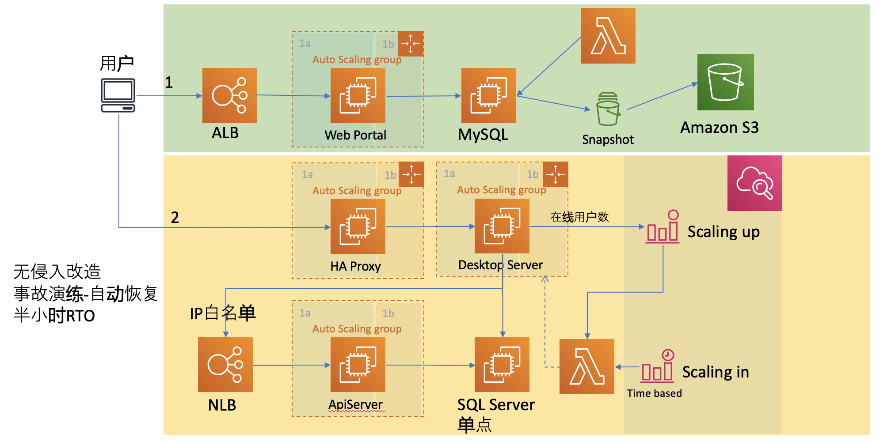

# It is the next gen auto deployment for project https://github.com/zhnc/aws-insfra/tree/kis-ningxia

It extract the app cluster deployment, refactor it by CDK, it more easy to deployment and maintain.

* `npm install`   install dependency
* `cdk deploy`    will help you to deploy a new app cluster with interactive parameters.

## Useful commands

 * `npm run test`         perform the jest unit tests
 * `cdk deploy`           deploy this stack to your default AWS account/region
 * `cdk diff`             compare deployed stack with current state
 * `cdk synth`            emits the synthesized CloudFormation template
